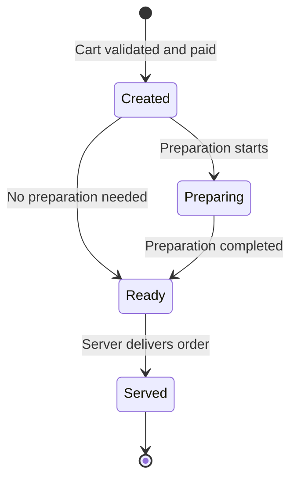

# illico-mande — Restaurant Ordering System (UML)

A UML modeling project for **illico-mande**, a restaurant ordering system. Customers scan a QR code at their table to open a table-specific web page, browse the menu, place an order and pay. A separate staff application supports the kitchen, servers and administrators.

This repository documents the **design of the system** through UML diagrams; the project report does not describe a working implementation.

## System scope

| Actor | Main interactions |
| --- | --- |
| Customer | Scan the table's QR code, browse the menu, manage a cart, order, pay and request assistance. Creating an account is optional. |
| Server | View assigned tables and orders, receive alerts and mark dishes as served. |
| Cook | View orders to prepare and update their preparation status. |
| Administrator | Manage staff accounts and table assignments, with access to staff functions. |

The model covers online payment methods and cash payments. For cash, the system alerts a server to collect the payment. Customers with accounts can access their order history and a loyalty balance.

## UML diagrams

The diagrams were created with **draw.io** and presented in the [project report](Rapport%20projet%20UML.pdf).

| Diagram | What it models |
| --- | --- |
| **Use case diagrams** | The interactions of customers, servers, cooks and administrators with the system. |
| **Class diagrams** | The structure and relationships of accounts, staff, tables, QR codes, customer sessions, menus, dishes, carts, orders and payments. |
| **Order state diagram** | The life cycle of an order from creation through preparation to service. |

The class model separates the customer session from an optional customer account. A table has its own QR code and an assigned server; an order is linked to the table and to the staff who prepare and serve it. The menu contains dishes and meal combinations, while a validated and paid cart becomes an order.

## Order life cycle

Once the cart is validated and paid, an order is created. The cook can mark it as being prepared and then ready to serve; the server marks it as served. The state diagram also allows an order that needs no preparation to proceed directly toward service.

The report discusses possible future additions such as preparation timers and reminders. They are design ideas rather than implemented features.

## Viewing the project

Open [`Rapport projet UML.pdf`](Rapport%20projet%20UML.pdf) to see the diagrams and their explanations. If editable draw.io source files are included in the repository, they can be opened in draw.io. The PDF link works when the report is placed at the repository root.

## Authors

**Naoufal Benamar** and **Hamza Laouni** — Computer Systems Modeling, **Sup Galilée**, 2023–2024. Supervised by **John Chaussard**.
